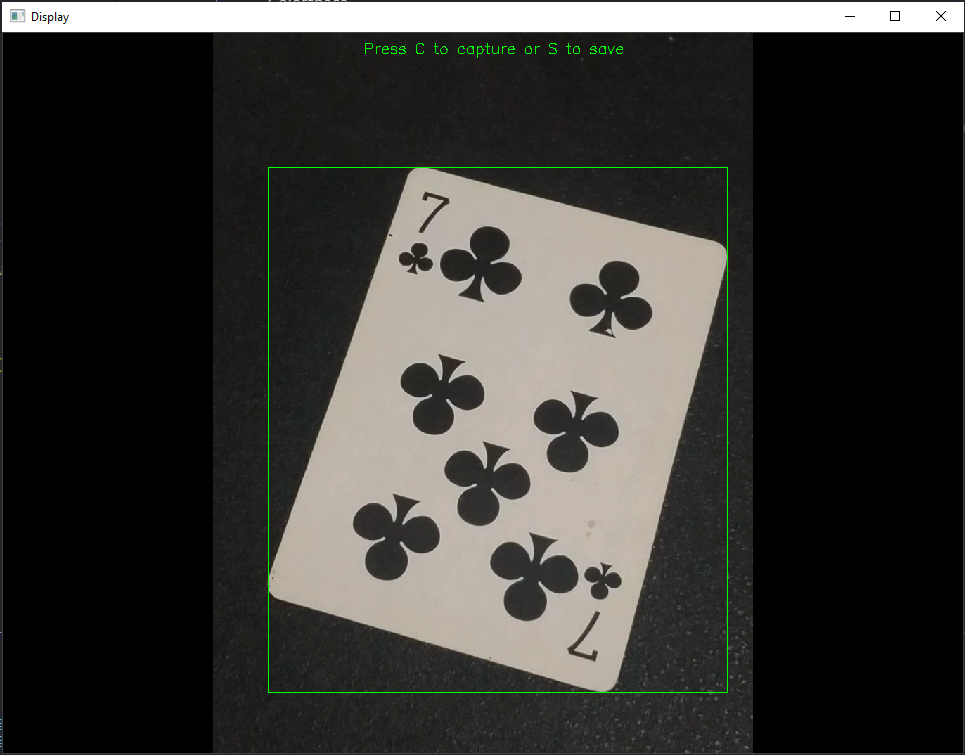
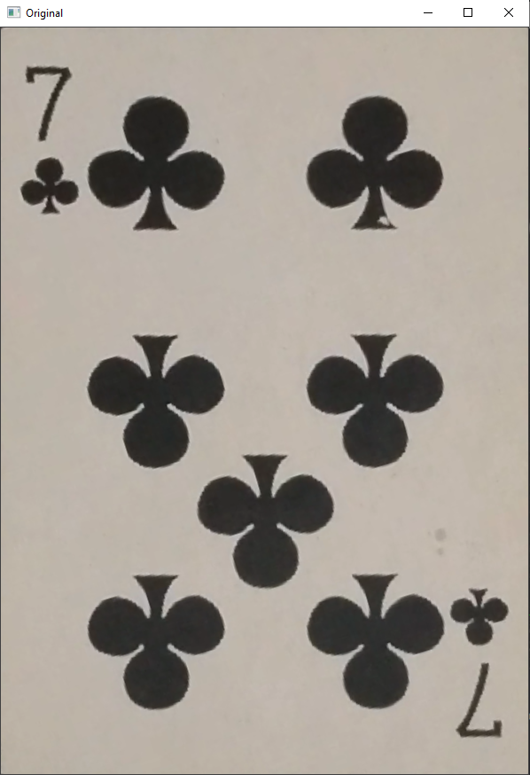
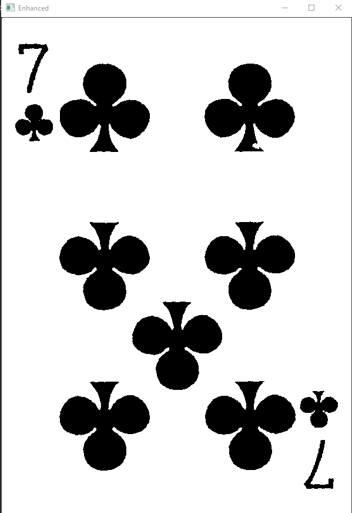

# Implementasi OOP
<b>Nama:</b> Akhmad Thoriq Afif  
<b>NRP:</b> 5024201028  
<b>Jurusan:</b> Teknik Komputer   
<i>Repositori ini dibuat untuk memenuhi tugas magang tim robotik ICHIRO ITS</i>

## Hasil Pembelajaran OpenCV
### Color Space
Digunakan untuk mengubah warna dari suatu gambar ke space warna lain seperti gray 
_Exercise:_ dalam folder Colorspace saya membuat perbandingan warna antara gray, hsv, dan hsl
### Smoothing
Biasa digunakan untuk mengurangi noise dari suatu gambar 
_Exercise:_ dalam folder smoothing saya menggunakan gaussian blur untuk mengaburkkan wajah yang terdeteksi
### Geometric transformation
Digunakan untuk mengubah bentuk dari suatu gambar. contoh rotasi, scalling, translasi, perspective transformation, dan affine transformation 
Untuk perbedaan antara perspective dan affine adalah perspective menggunakan empat titik sebagai acuan sedangkan affine menggunakan tiga titik 
_Exercise:_ dalam folder GeometricTrannsformation saya memanfaatkan perspective tranformation untuk mengubah perpektif dari kartu yang diletakkan secara miring

## Project dengan OpenCV
Beberapa project yang saya buat dengan menggunakan OpenCV
### __CamScanner__
Program ini berfungsi untuk memindai dokumen ke dalam file digital yang nantinya dapat disimpan dalam bentuk file `.jpg`

__Contoh Hasil__

  
  
  

### __Color Detection (Tugas Opsional)__
Program ini berfungsi untuk mendeteksi warna suatu benda yang diletakkan pada background berwarna. Hasil output warna berupa nilai Hue

